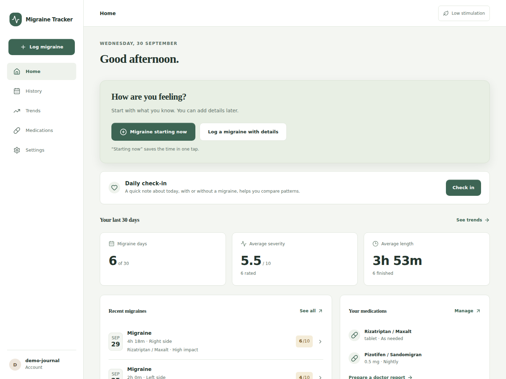
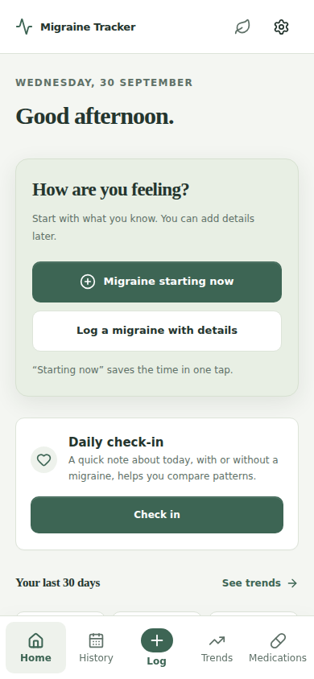

# Migraine Tracker

A private, self-hosted migraine journal, designed for the moments when using an app should take as little effort as possible.

One tap starts an episode. Add severity, symptoms, medication, sleep and impact whenever you feel ready. Review patterns and bring a factual report to your doctor.



<details><summary>Phone view</summary>



</details>

Screenshots use synthetic demonstration records, never real health data.

## Features

- One-tap active migraine; quick entry, editing, ending and deletion.
- Symptoms, pain location/character, associated factors, sleep and functional impact.
- Acute/preventive medication schedules, dose records, relief reviews and generic side effects.
- History search/filtering and monthly severity calendar.
- Timezone-aware trends, previous-period metrics and preventive before/after comparisons.
- Daily check-ins for context on non-migraine days; optional weight journal.
- Downloadable doctor PDF, CSV, JSON and full ZIP exports; portable JSON import CLI.
- Local Argon2id login and optional Authentik OIDC with owner-subject allowlisting.
- Installable mobile PWA, light/dark/system theme, low-stimulation mode, private offline shell.
- Consistent SQLite backups, optional daily backup container, validated restore with safety backup.
- One disposable application container; persistent Docker volume; optional published GHCR/Docker Hub images on release; no cloud SaaS.

This application records and summarises information and does not provide medical advice. Associations and before/after changes do not establish causation.

## Quick start

Requires Docker Engine and Docker Compose v2, plus an existing HTTPS reverse proxy.

```sh
git clone https://github.com/uniskela/migraine-tracker.git
cd migraine-tracker
cp .env.example .env
openssl rand -hex 32
# Put the generated value in SETUP_SECRET. Set APP_ORIGIN to your HTTPS origin.
chmod 600 .env
docker compose up -d --build
docker compose ps
```

Point your reverse proxy at `127.0.0.1:3000` (host proxy), or attach a container proxy to the Compose network and use `app:3000`. Configure trusted proxy IPs/CIDRs as described in [installation](docs/installation.md). The published port is bound to loopback by default. Visit your HTTPS origin and enter the setup secret to create the owner account. Setup then closes permanently.

Subsequent startup: `docker compose up -d`. Optional scheduled backups: `docker compose --profile backups up -d`.

**Make an off-host backup.** A Docker volume survives container recreation, but cannot protect against host/disk loss. Never run `docker compose down -v` unless deliberately deleting all journal data.

```sh
./scripts/backup.sh
./scripts/restore.sh "/app-data/backups/migraine-tracker-2026-09-28T23-00-00-000Z-example.tar.gz"
```

Replace the example archive filename with the actual filename printed by the backup command.

Restore stops the app and scheduler, validates the archive, makes a safety backup, preserves the old database directory and verifies the restored database. Restart explicitly after reviewing success. See [backup](docs/backups.md) and [restore](docs/restore.md) instructions before relying on it.

## Architecture

React + TypeScript + Vite frontend, Express server, Drizzle ORM/migrations and SQLite WAL database. The production server serves the built frontend and API from one origin. No Redis, queues, microservices, CDN, remote fonts, telemetry or external APIs. Only configured OIDC contacts an external provider.

Business calculations and validation are shared; authentication, persistence, reporting and backup operations are separate server modules. [Architecture and milestones](docs/architecture.md) describe the data model and PostgreSQL migration path.

## Documentation

- [Installation and reverse proxy](docs/installation.md)
- [Environment configuration](docs/configuration.md)
- [Authentik setup](docs/authentik.md)
- [Backups](docs/backups.md) · [Restore / disaster recovery](docs/restore.md)
- [Upgrades](docs/upgrades.md)
- [Security and threat model](docs/security.md)
- [Development and tests](docs/development.md)
- [Verification evidence and limitations](docs/verification.md)

## Practical limits

One owner per installation. No offline writes or cached private records, push reminders, diagnosis or medication advice. The offline PWA provides navigation and a reconnect screen. Reports depend on consistent self-reporting; blank days are not confirmed symptom-free days. Backups and exports are not encrypted by the app; use encrypted disks and encrypted off-host storage. Deployment credentials in `.env` need a separate encrypted backup.

## Development

Node 22 LTS, `npm ci`, then see [development](docs/development.md). `npm run lint`, `npm run typecheck`, `npm test`, `npm run build`, and `npm run test:e2e` are the local gates. CI also builds and smoke-tests Docker and scans for container vulnerabilities and secrets (Trivy + Gitleaks). Stable GitHub Releases publish multi-arch images to GHCR (and Docker Hub when secrets are set), whether created manually or by Release Please. See [release publishing](docs/development.md#release-publishing) for tags and recovery steps.
